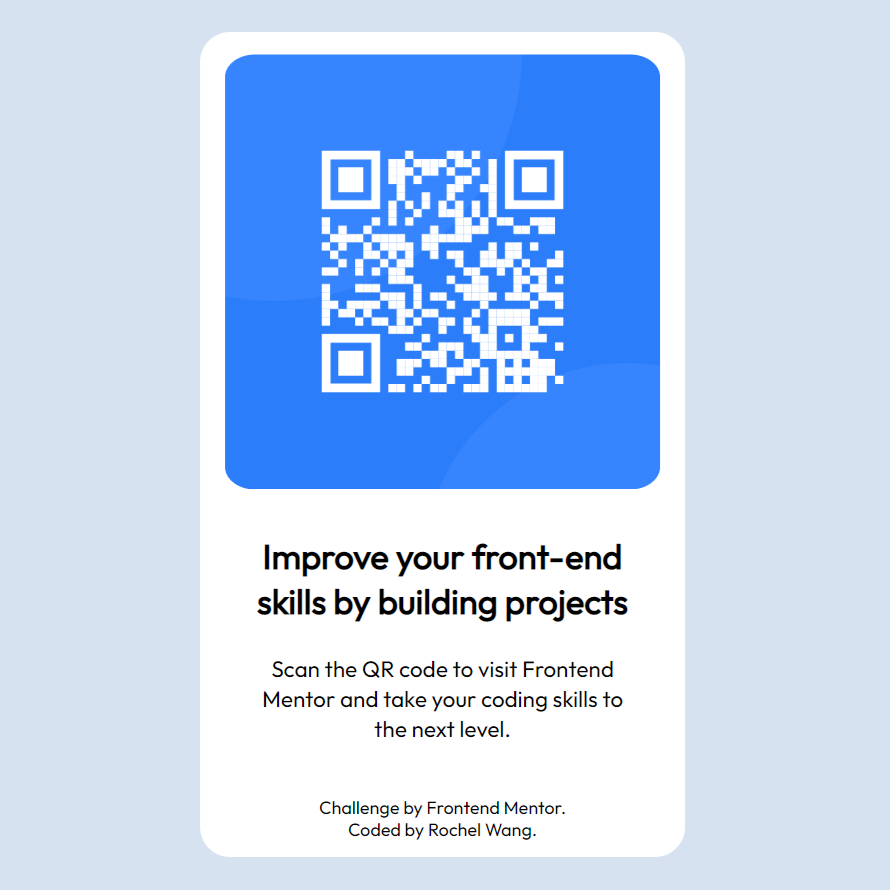

# Frontend Mentor - QR code component solution

This is a solution to the [QR code component challenge on Frontend Mentor](https://www.frontendmentor.io/challenges/qr-code-component-iux_sIO_H). 
## Table of contents

- [Overview](#overview)
  - [Screenshot](#screenshot)
- [My process](#my-process)
  - [Built with](#built-with)
  - [What I learned](#what-i-learned)
  - [Useful resources](#useful-resources)
- [Author](#author)


## Overview
This is my first try on "Fronted Mentor". This task help me to review basic concept of HTML and CSS.
I spent about 1 hour to finish this and learned a lot!
### Screenshot



## My process

### Built with

- Semantic HTML5 markup
- CSS custom properties

### What I learned

I learned how to use 'font-weight' in CSS to determine text's weight. And import font-family from google library.

To see how you can add code snippets, see below:

```html
<link rel="stylesheet" href="style.css">
<link rel="preconnect" href="https://fonts.googleapis.com">
<link rel="preconnect" href="https://fonts.gstatic.com" crossorigin>
```
```css
.code h3{
  font-weight:400;
  }
```

### Useful resources

- [Google Fonts](https://fonts.google.com/) - Many fonts to choose! 
- [在 CSS 中匯入 Google 字型](https://www.delftstack.com/zh-tw/howto/css/css-import-google-font/) - This is an amazing article which helped me how to import fonts from Google Fonts.

## Author

- Website - [Rochel Wang](https://github.com/rochelwang1205)
- Frontend Mentor - [@Rochel Wang](https://www.frontendmentor.io/profile/rochelwang1205)
- Twitter - [@RochelWang4](https://twitter.com/RochelWang4)
